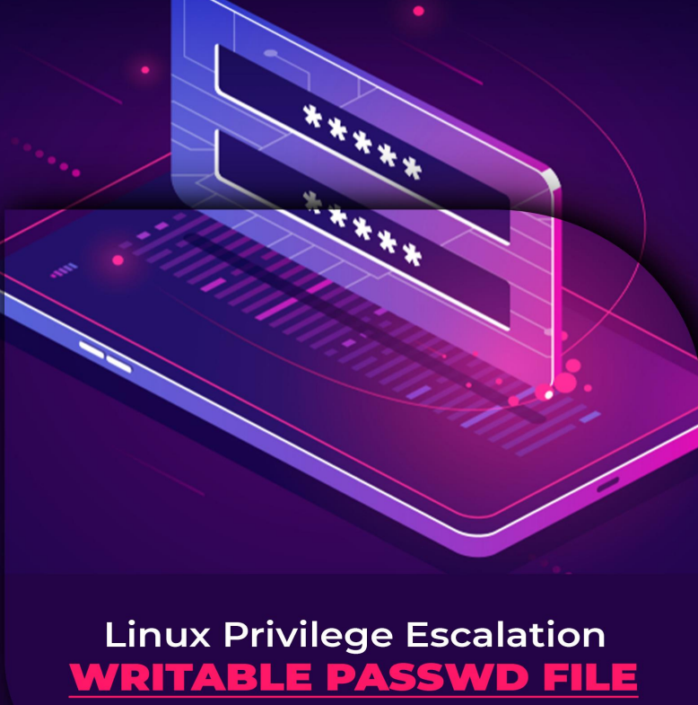

# 👑 ESCALAR PRIVILEGIOS EN WINDOWS Y LINUX - WINPEAS, LIMPEAS, POWERUP, SEAT BELT, SHARPUP, PRIV

<figure><figcaption></figcaption></figure>





<figure><figcaption></figcaption></figure>





<figure><figcaption></figcaption></figure>




