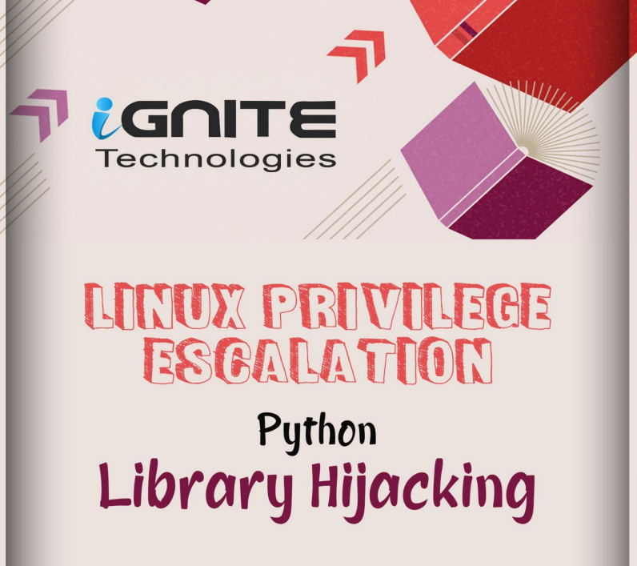

# 🐍 Linux Privilege Escalation - Python Library Hijacking

En general, siempre que un atacante se introduce dentro de un entorno que tiene archivos Python, las opciones que el atacante puede utilizar para aumentar su acceso son limitadas. Hay tres métodos que descubriremos en el artículo. Algunas configuraciones erróneas incluyen permisos de escritura, privilegios sudo y edición de la variable de ruta

<figure><figcaption></figcaption></figure>




