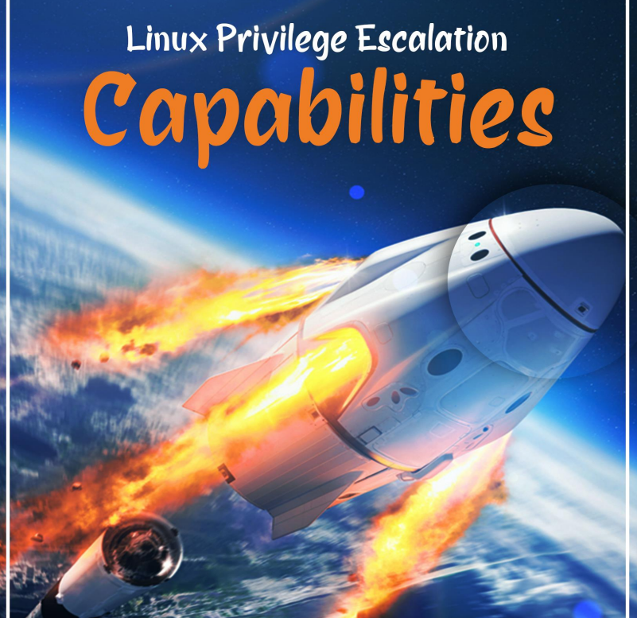

# 👥 Linux Privilege Escalation using Capabilities

Las capacidades funcionan dividiendo las acciones normalmente reservadas para enraizar en porciones más pequeñas. El uso de capacidades recién está comenzando a incluirse en las aplicaciones del usuario, ya que la mayoría de las utilidades del sistema no pierden sus privilegios de root. Sigamos adelante y veamos cómo podemos usar más este permiso en nuestras tareas.

<figure><figcaption></figcaption></figure>




