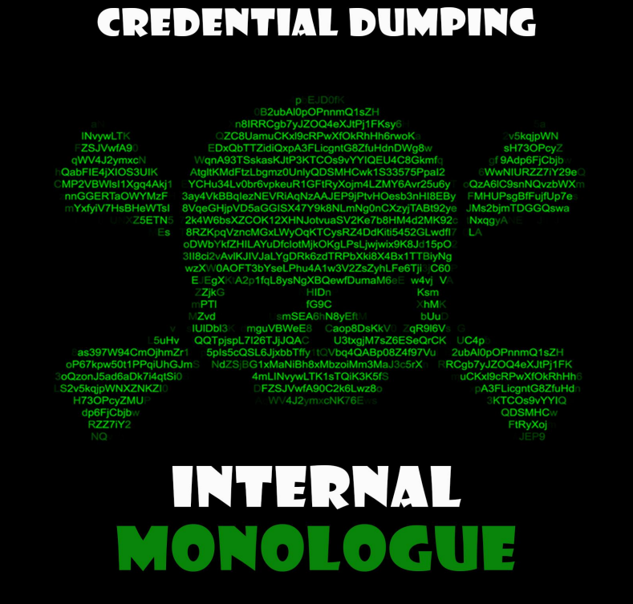

# ☠️ Ataque de degradación de NTLM - Monólogo interno

Mientras se realizan operaciones del Equipo Rojo, es posible encontrarse con un escenario en el que el atacante no puede utilizar Mimikatz. Esto podría deberse a que casi todos los programas antivirus o de malware detectarán la presencia de Mimikatz tan pronto como llegue a la máquina de destino. Este es el escenario en el que un atacante puede realizar un ataque de monólogo interno. Para realizar este ataque, se requirió una herramienta desarrollada por Elad Shamir de Missing Link Security.

Al estar en contacto con el Mecanismo de seguridad de Windows, estará familiarizado con NetNTLM. Es un protocolo basado en respuesta a desafíos que se utiliza donde Windows no puede aplicar la autenticación basada en Kerberos. En este método, el servidor envía un desafío de 8 bytes con el hash NTLM como clave al usuario. El hash es un hash MD4 de la contraseña del usuario. Hay dos versiones de NetNTLM. Ambos son vulnerables. La versión 1 de NetNTLM se introdujo hace bastante tiempo y actualmente está deshabilitada de forma predeterminada.

En un sentido general, el ataque de degradación se realizó contra el propio Mimikatz. Después de la explotación de la máquina objetivo, el atacante, ya sea usando Mimikatz o manualmente, puede editar claves de registro como LMCompatibilityLevel con valores como 0,1,2 que pueden hacer que el dispositivo comprometido use la versión anterior o degradada de NTLM para interactuar. con otros servidores SMB y puede llevar a cambiar a otros usuarios y servidores.

Sin embargo, en este ataque que se describe en la demostración, no se utiliza Mimikatz y, en cambio, el atacante invoca una llamada a un procedimiento local desde una aplicación en modo de usuario al paquete de autenticación NTLM a través del SSPI. Esto calcula la respuesta NetNTLM que analizamos anteriormente en el contexto del usuario que inició sesión. El ataque inhabilita inherentemente los controles preventivos NetNTLMv1, luego extrae todos los tokens de inicio de sesión que no son de red de los procesos actualmente en ejecución y se hace pasar por los usuarios asociados. Para cada usuario suplantado, NTLM SSP invoca localmente una respuesta NTLMv1 al desafío elegido y luego restaura los valores originales de las claves de registro analizadas anteriormente. Ahora el hash capturado se puede descifrar con la herramienta de tu preferencia, como John the Ripper o Hash Cat.

<figure><figcaption></figcaption></figure>




