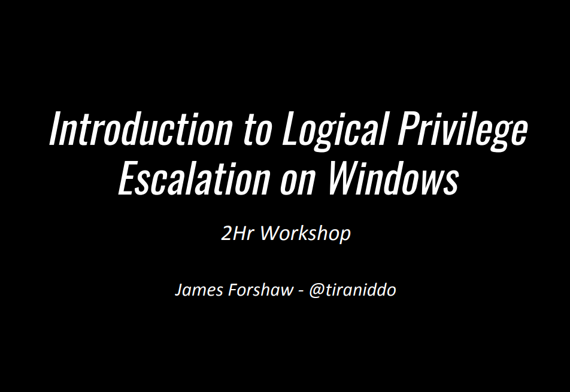

# 👑 ESCALAR PRIVILEGIOS EN WINDOWS Y LINUX - WINPEAS, LIMPEAS, POWERUP, SEAT BELT, SHARPUP, PRIVESCHEK..

Cuando un atacante ataca un sistema operativo Windows la mayor parte del tiempo, obtendr치 una sesi칩n base shell o meterpreter. Este caparaz칩n est치 limitado en las acciones que puede realizar. Entonces, para elevar los privilegios, necesitamos enumerar diferentes archivos, directorios, permisos, registros y archivos SAM. La cantidad de archivos dentro de un sistema operativo Windows es abrumadora. Por lo tanto, realizar esta tarea manualmente es muy dif칤cil incluso cuando sabes d칩nde buscar. Entonces, 쯣or qu칠 no automatizar esta tarea mediante scripts?

<figure><figcaption></figcaption></figure>





<figure><figcaption></figcaption></figure>





<figure><figcaption></figcaption></figure>




