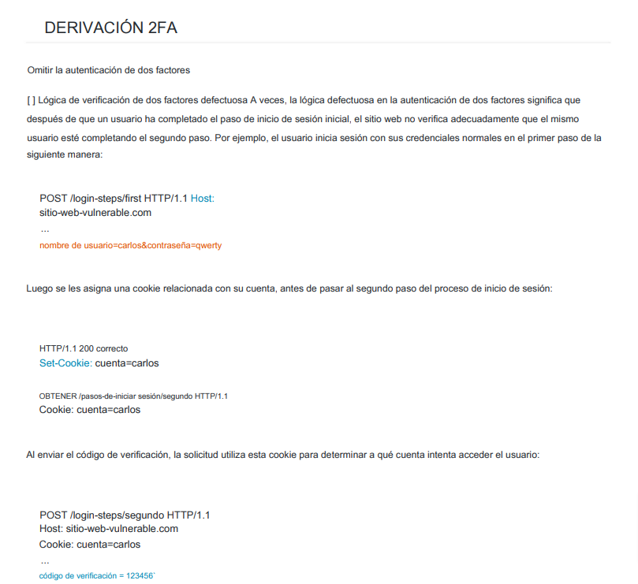

# 🙌 2FA BYPASS

Omitir la autenticación de dos factor

&#x20;Lógica de verificación de dos factores defectuosa A veces, la lógica defectuosa en la autenticación de dos factores significa que después de que un usuario ha completado el paso de inicio de sesión inicial, el sitio web no verifica adecuadamente que el mismo usuario esté completando el segundo pa

<figure><figcaption></figcaption></figure>




