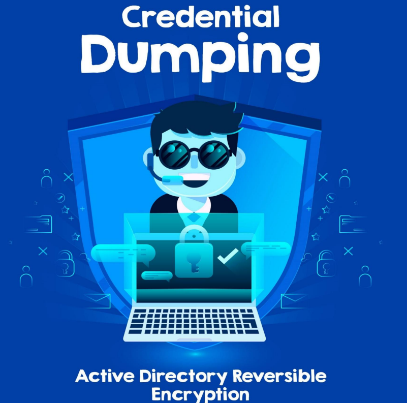

# 💫 Cifrado\_de\_credenciales\_reversible\_Encryption

Volcado de credenciales: contraseña de texto sin formato de Active Directory

Según MITRE, un adversario puede abusar de las propiedades de cifrado de autenticación de Active Directory para obtener acceso a las credenciales en los sistemas Windows. La propiedad AllowReversiblePasswordEncryption especifica si el cifrado de contraseña reversible para una cuenta está habilitado o deshabilitado. De forma predeterminada, esta propiedad está deshabilitada (en lugar de almacenar las credenciales del usuario como resultado de funciones hash unidireccionales) y no debe habilitarse a menos que el software heredado u otro software lo requiera.

En el controlador de dominio, el cifrado reversible de la cuenta de usuario está habilitado, lo que significa que los datos cifrados se pueden revertir a la contraseña del usuario. La contraseña almacenada con una política de cifrado reversible no es un hash, ya que se puede llamar a una función para volver a la contraseña original en texto sin cifrar.

<figure><figcaption></figcaption></figure>




