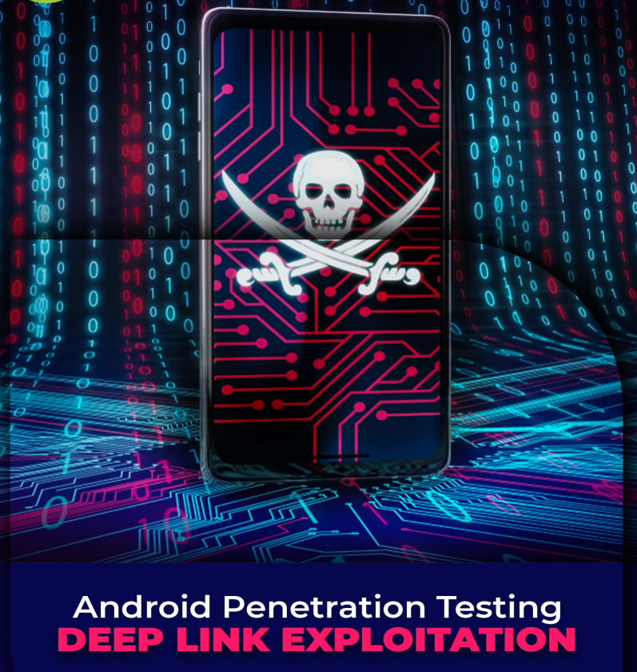

# 👾 DEEP LINK EXPLOTATION - enlaces maliciosos android

En muchos escenarios, una aplicación necesita trabajar con URL basadas en web para autenticar a los usuarios mediante el inicio de sesión de Oauth, crear y transportar ID de sesión y varios otros casos de prueba. En tales escenarios, los desarrolladores configuran enlaces profundos, también conocidos como esquemas de URL personalizados que le indican a la aplicación que abra un tipo específico de URL en la aplicación directamente. Esto sólo funciona en Android v6.0 y superior. El filtro de intención para aceptar URI que tienen ejemplo.com como host y http:// como esquema de URL se define en un archivo de manifiesto de Android de la siguiente manera:

Preste atención a los datos android:scheme=”http” y android:host=””

Habremos de esto en el siguiente PDF.

<figure><figcaption></figcaption></figure>




