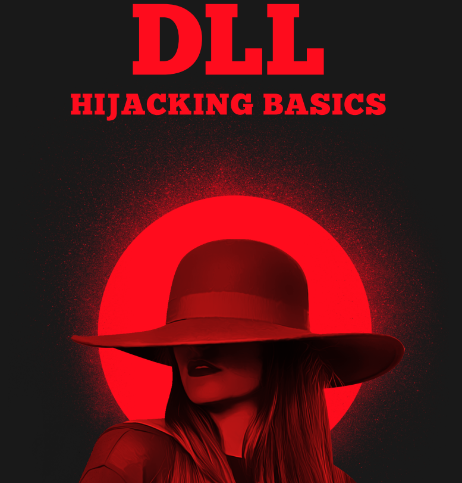

# 🫂 DLL Hijacking - DLL Preloading explota el manejo de carga de archivos DLL por parte de SO

El secuestro de DLL es un tipo de ciberataque en el que un actor malintencionado aprovecha el orden de búsqueda de un sistema de bibliotecas de vínculos dinámicos (DLL) para cargar y ejecutar código malicioso en lugar de bibliotecas legítimas. En otras palabras, se refiere a engañar a un programa para que cargue una biblioteca de códigos dañinos en lugar de la segura. Antes de entrar en detalles, echemos un vistazo a los archivos.

DLL (significa biblioteca de enlaces dinámicos) es un archivo que contiene código y datos reutilizables que múltiples programas pueden usar al mismo tiempo para realizar diferentes funciones, mejorando la eficiencia y la modularidad en el desarrollo de software.

<figure><figcaption></figcaption></figure>




