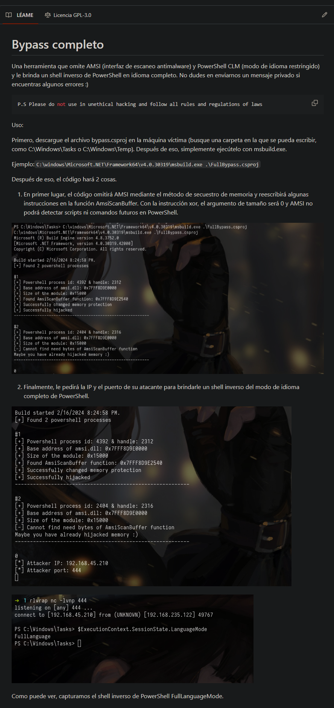

# 🏹 FULLBYPASS ANTIMALWARE ATACK

Una herramienta que omite AMSI (interfaz de escaneo antimalware) y PowerShell CLM (modo de idioma restringido) y le brinda un shell inverso de PowerShell en idioma completo. No dudes en enviarnos un mensaje privado si encuentras algunos errores :)

Lick: [https://github.com/Sh3lldon/FullBypass](https://github.com/Sh3lldon/FullBypass)&#x20;

<figure><figcaption></figcaption></figure>
