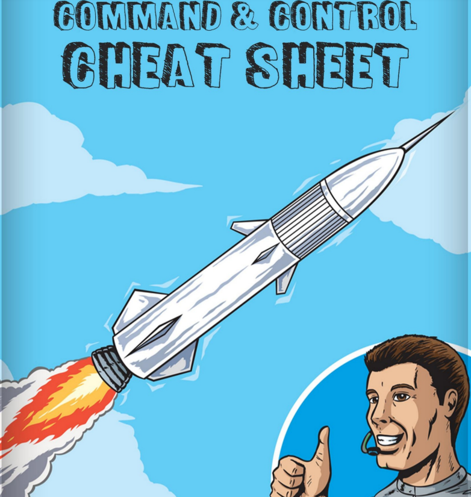

# 🎮 GUIA DETALLADA DE COMO MONTAR UN  "C2" o "C\&C"                      ( Comando y Control)

Comando y Control, abreviado como "C2" o "C\&C", es una táctica en el marco de Mitre ATT\&CK que consta de varias técnicas, en las que cada técnica define diferentes formas de lograr la conexión entre el host y el centro de comando y control. Comando y Control, abreviado como "C2" o "C\&C", es una táctica en el marco de Mitre ATT\&CK que consta de varias técnicas, en las que cada técnica define diferentes formas de lograr la conexión entre el host y el centro de comando y control. Aquí el host son los agentes que se ejecutan en una máquina explotada, lo que da como resultado la inyección de comandos para recuperar información.

<figure><figcaption></figcaption></figure>




