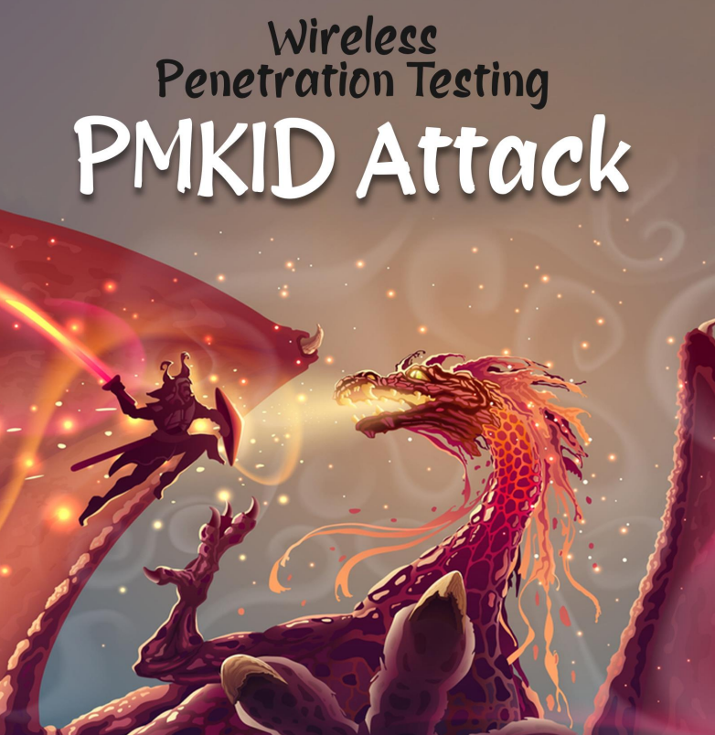

# ♻️ HCXTOOLS - ATAQUE A PMKID wireless WI-FI auditoria

El ataque PMKID fue desarrollado por Team Hashcat. Los métodos tradicionales de captura de protocolo de enlace y fuerza bruta esperan a que el cliente anule la autenticación y vuelva a autenticarse, mientras que el ataque PMKID no lo hace. PMKID directo es

capturado en este ataque y luego resquebrajado. Este ataque funciona en los protocolos WPA y WPA2 y estudios recientes han demostrado poco o ningún éxito en WPA3 y son mucho más resistentes a los ataques PMKID

<figure><figcaption></figcaption></figure>




