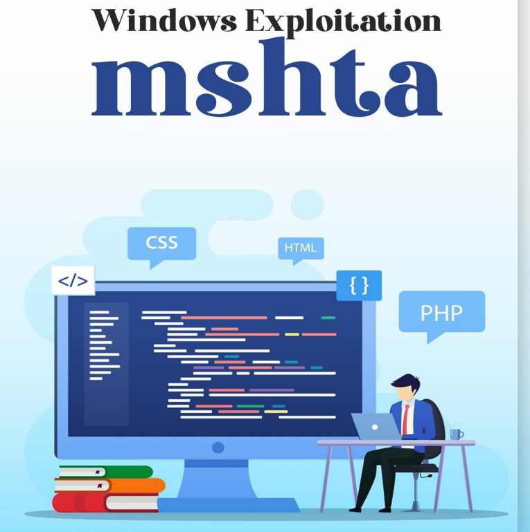

# ⏸️ MSHTA - WINDOWS EXPLOTACION

Los archivos HTA son bien conocidos en el mundo de la ciberseguridad desde la perspectiva tanto del equipo rojo como del equipo azul como una de esas formas "retro" valiosas de eludir la lista blanca de aplicaciones.

Mshta.exe ejecuta Microsoft HTML Application Host, la utilidad del sistema operativo Windows responsable de ejecutar archivos HTA (aplicación HTML). Podemos ejecutar JavaScript o Visual con archivos HTML. Puede interpretar estos archivos utilizando la herramienta Microsoft MSHTA.exe.

Utilizar archivos HTA para ataques web. Hay mucha adaptabilidad dentro de un archivo HTA; efectivamente hará que parezca un actualizador de Adobe, un registro seguro por usuario y una serie de cosas más.

También sería útil tener el archivo HTA a través de HTTPS para limitar las tasas de descubrimiento para las empresas que no utilizan algún tipo de interceptación/terminación de SSL. Los registros HTA ayudan a eludir los antivirus, ya que aún no están bien identificados. Por último, pero no menos importante, HTA también se puede utilizar en phishing web, reemplazando el antiguo ataque Java Applet.

Existen varios métodos para un ataque HTA. Y ahora vamos a arrojar luz sobre casi todos ellos en este apunte:

<figure><figcaption></figcaption></figure>




