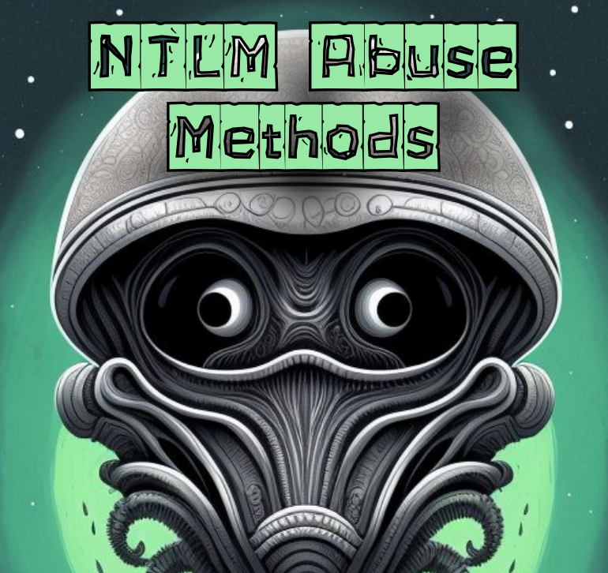

# ✍️ NTLM (NT LAN Manager) ABUSE METODOS - aprovecha protocolo de autenticación,etc

Abusando del método NTLM (NT LAN Manager) es un protocolo de autenticación utilizado en sistemas Windows para permitir a los usuarios acceder a recursos compartidos de red.

<figure><figcaption></figcaption></figure>




