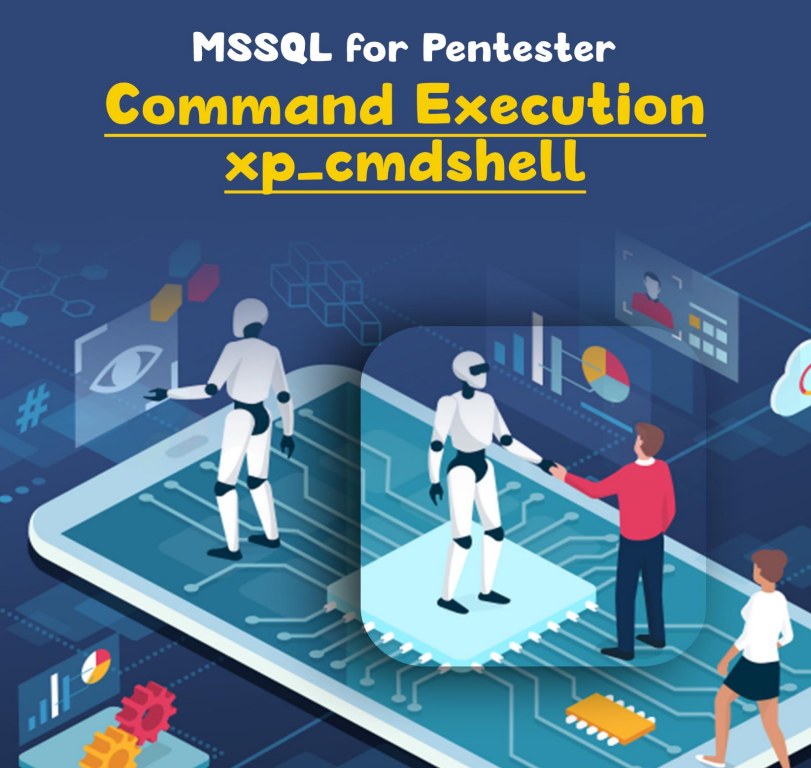
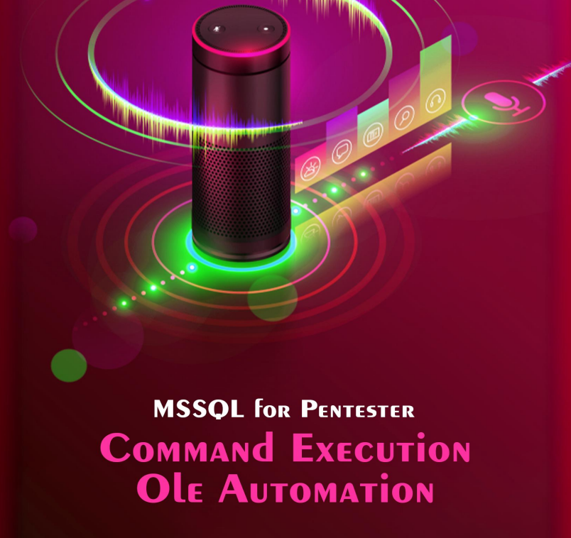

# 🏗️ SERVER MSSQL (Microsoft SQL Server) - EJECUCION DE COMANDOS - XP\_CMDSHELL - y OLE AUTOMATIZADO

Según la documentación oficial de Microsoft, xp\_cmdshell es una funcionalidad que genera un shell de comandos de Windows y pasa una cadena para su ejecución. Cualquier resultado que genere se muestra en formato de filas de texto. Para simplificar, podemos decir que permite a los administradores de la base de datos acceder y ejecutar cualquier proceso externo directamente desde SQL Server. La implementación de xp\_cmdshell se remonta a SQL Server 6.5. Fue diseñado para utilizar consultas SQL con el comando del sistema para automatizar diversas tareas que requerirían programación y trabajo adicionales. Ahora que tenemos algunos conocimientos sobre xp\_cmdshell, podemos ver cómo se puede habilitar en un servidor SQL.

<figure><figcaption></figcaption></figure>





<figure><figcaption></figcaption></figure>




