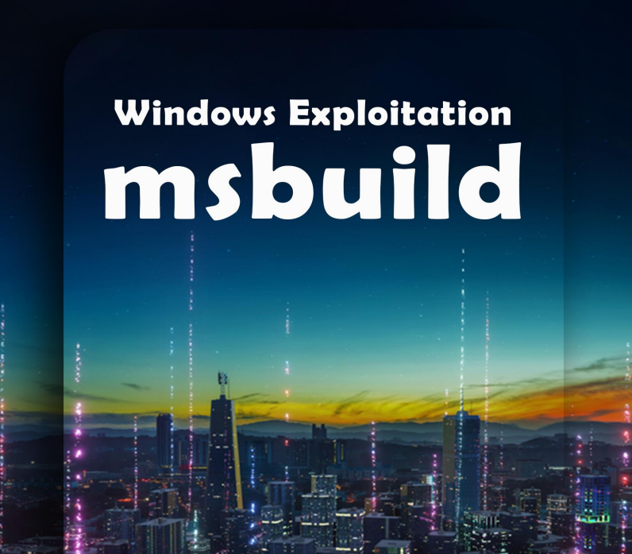

# ✌️ Windows Exploitation - msbuild.exe

Microsoft Build Engine es una plataforma para crear aplicaciones. Este motor, que también se conoce como MSBuild, proporciona un esquema XML para un archivo de proyecto que controla cómo la plataforma de compilación procesa y crea software. Visual Studio usa MSBuild, pero no depende de Visual Studio. Al invocar msbuild.exe en su proyecto o archivo de solución, puede organizar y crear productos en entornos donde Visual Studio no está instalado.

Y aprovechando un proyecto de MSBuild y su complilacion se veran varios metodods de generar codigos para su explotacion:&#x20;

<figure><figcaption></figcaption></figure>





