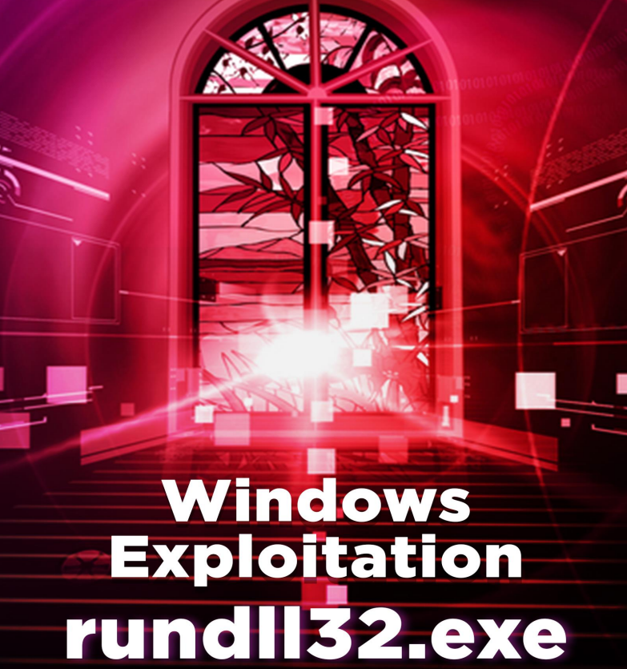

# 🫶 Windows Exploitation - rundll32.exe

Los archivos DLL de Windows son muy importantes para que funcione el sistema operativo Windows y también determinan el funcionamiento de otros programas que personalizan su Windows. Los archivos de biblioteca de vínculos dinámicos (DLL) son tipos de archivos que brindan instrucciones a otros programas sobre cómo utilizar ciertas cosas. Por lo tanto, varios programas pueden compartir dichos archivos DLL, incluso simultáneamente. A pesar de tener el mismo formato que un archivo.exe, los archivos DLL no son directamente ejecutables como los archivos .exe. Las extensiones de archivo DLL pueden ser: .dll (Biblioteca de vínculos dinámicos), .OCX (controles ActiveX), .CPL (Panel de control), .DRV (controladores de dispositivos).

Cuando están en uso, los archivos DLL se dividen en secciones. Esto hace que el trabajo con archivos DLL sea más fácil y rápido. Cada sección se instala en el programa principal en tiempo de ejecución. Como cada sección es diferente e independiente; el tiempo de carga es más rápido y solo se realiza cuando se requiere la funcionalidad de dicho archivo. Esta capacidad también hace que las actualizaciones sean más fáciles de aplicar sin afectar otras secciones. Por ejemplo, tienes un programa de diccionario y cada mes se añaden nuevas palabras, por lo que para ello lo único que tienes que hacer es actualizarlo; sin tener que instalar otro programa completo para ello.

En este PDF se usaran varios metodos para explotar estas bobliotecas:

<figure><figcaption></figcaption></figure>




