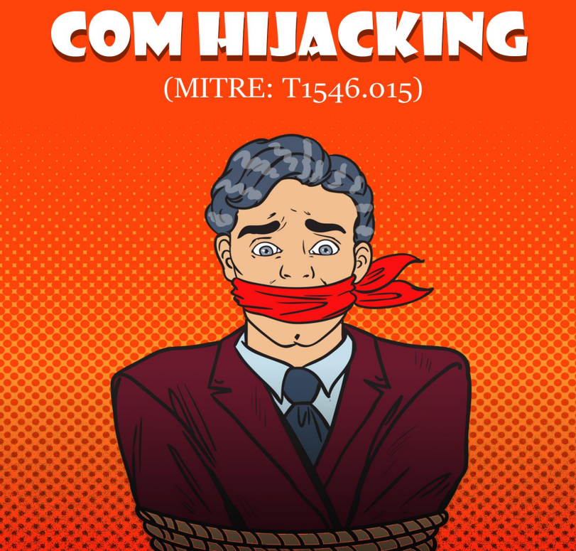

# 👌 Windows Persistence\_ COM Hijacking (MITRE\_ T1546.015)

Según MITRE, "los adversarios pueden utilizar el sistema COM para insertar código malicioso que puede ejecutarse en lugar de software legítimo mediante el secuestro de las referencias y relaciones COM como medio de persistencia". Para secuestrar un objeto COM, un atacante debe realizar ciertos cambios en las secciones del registro y reemplazar la referencia a un componente legítimo del sistema por uno malicioso. Cuando se ejecuta esa aplicación y se llama al objeto COM, en su lugar se ejecuta el malware, lo que proporciona persistencia. En este artículo, cubriremos la metodología para el secuestro de COM

<figure><figcaption></figcaption></figure>




