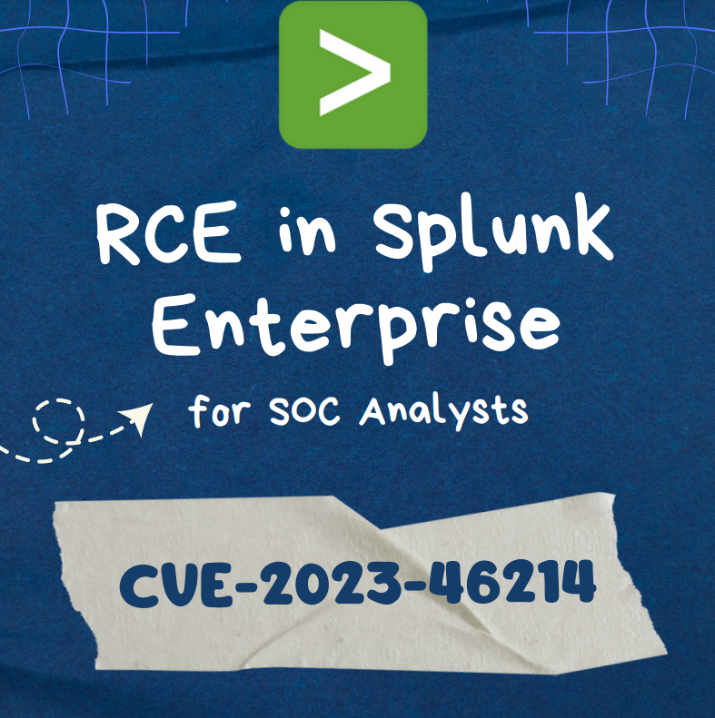

# 🧑‍🔧 For\_SOC\_Analysts-REC\_in\_splunk\_Enterprise-cve-2023-46214

En los registros del proxy se detectó el intento del atacante de cargar "shell.xsl" en el sistema para explotar la vulnerabilidad "CVE-2023-46214" en Splunk. Posteriormente se pudo observar que el atacante recibió un proyectil inverso. Por tanto, se recomienda aislar el sistema de la red. La operación relevante se puede realizar en Endpoint Security de la siguiente manera

<figure><figcaption></figcaption></figure>




