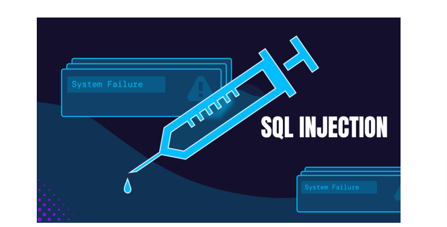

# 💉 SQL INYECTION

¿qué es la inyección SQL? Es como el truco mental Jedi del mundo de la piratería. Implica manipular un sitio web o una aplicación para que derrame información sobre su base de datos. Piense en ello como un juego de manos digital.

¿Por qué debería importarte? Bueno, SQL es el lenguaje que entienden las bases de datos. Si los atacantes pueden inyectar código SQL malicioso, pueden controlar lo que hace la base de datos. Imagínese a un titiritero moviendo los hilos detrás de escena.

hablemos de verdad. La inyección SQL no es sólo una amenaza teórica. Ha causado importantes violaciones de datos, pérdidas financieras y dolores de cabeza para las empresas. Exploraremos algunos ejemplos notorios que te harán levantar una ceja.

Así que ¡abróchate el cinturón! Estamos a punto de desentrañar los misterios de la inyección SQL de una manera que incluso su amigo no experto en tecnología puede aceptar.

<figure><figcaption></figcaption></figure>




