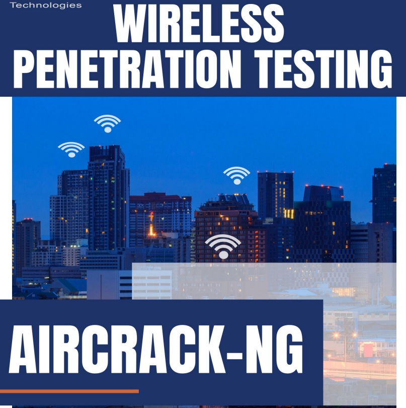

# 📡 AIRCRACK-NG - wireless WI-FI auditoria y FUERZA BRUTA A HANDSHAKE

Aircrack-ng es un paquete de herramientas de evaluación de seguridad de redes Wi-Fi. Dispone de un detector, un rastreador de paquetes, WPA/WPA2-PSK y un cracker y analizador WEP para LAN inalámbricas 802.11. Con la ayuda de Aircrack-ng, un probador de penetración puede centrarse en los aspectos de monitoreo, ataque, prueba y descifrado de la seguridad Wi-Fi. El monitoreo incluye la captura de paquetes y la exportación de datos a archivos de texto para procesarlos con cualquier herramienta de terceros. Los ataques incluyen ataques de repetición, desautenticación, ataques de gemelos malvados y ataques de inyección de paquetes. Las pruebas incluyen la prueba de las tarjetas Wi-Fi y las capacidades del controlador en función de la captura y las inyecciones. Finalmente, Cracking incluye la capacidad de crackear las claves WEP y WPA PSK.

Aircrack-ng es compatible con Linux, FreeBSD, macOS, OpenBSD, Android y Windows

<figure><figcaption></figcaption></figure>




