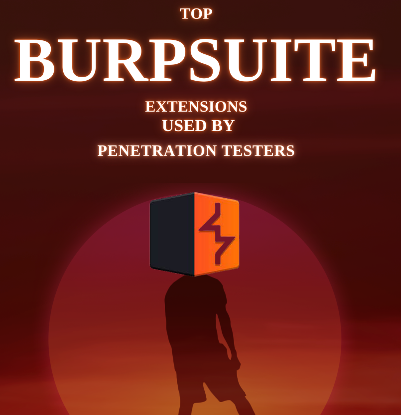

# 🤮 BURPSUITE

Para proteger los activos en línea, las pruebas de seguridad de las aplicaciones web son un elemento esencial para salvaguardarlos. Burp Suite ha sido líder en esta área durante muchos años y todavía lo utilizan profesionales de la seguridad y piratas informáticos éticos. Una de esas extensiones que destaca en la comunidad de pruebas de seguridad web es "Autorize", que viene con una amplia variedad de características adicionales para mejorar sus capacidades. Con esta extensión está disponible un potente conjunto de funciones que simplifican el proceso de prueba de autenticación y autorización.

La autorización incluye cualquier método mediante el cual un sistema otorga o revoca permiso para acceder a datos específicos. • Control de acceso basado en roles (RBAC) inadecuado: puede descubrir problemas en los que los roles o permisos de los usuarios no se aplican adecuadamente, lo que permite a los usuarios acceder a funciones o datos a los que no deberían tener acceso. datos o acciones. Mientras tanto, la autenticación es un proceso mediante el cual un individuo o un sistema se autentica como quien dice ser.

• Vulnerabilidades comunes detectadas por Autorize

• Comprensión de la funcionalidad

• Instalación y configuración

• Opciones de navegación y configuración

<figure><figcaption></figcaption></figure>





***

¿No es una tarea aburrida y que consume un poco de tiempo insertar una nueva carga útil manualmente cada vez para una vulnerabilidad específica y verificar su respuesta? Entonces, hoy en esta publicación exploraremos uno de los mejores complementos de burp suite, "Hack Bar" , que acelerará todas nuestras tareas de inserción manual de carga útil y funcionará con casi todas las vulnerabilidades principales.

¿Qué es Hack Bar?

Hackbar es un complemento diseñado para los probadores de penetración, con el fin de ayudarlos a acelerar sus procedimientos de prueba manuales. Sin embargo, la barra de pirateo está diseñada específicamente para las extensiones del navegador, que contiene una serie de diccionarios según el tipo de vulnerabilidad, ya sea inyección SQL, secuencias de comandos entre sitios o redirecciones de URL. Esta barra de hacks está diseñada de forma algo similar a las barras de direcciones de los navegadores.

Burp's Hack Bar es un complemento de Burpsuite basado en Java que ayuda a los evaluadores a insertar cualquier carga útil eligiendo entre una variedad de listas desplegables diferentes. Aunque funciona igual que la hackbar del navegador, su diseño e implementación son totalmente diferentes.

<figure><figcaption></figcaption></figure>





***

¿Qué es Turbo Intruso?

Turbo Intruder es una de las mayores extensiones de suite de eructos escritas por "James Kettle" para enviar una gran cantidad de solicitudes HTTP y analizar los resultados. Sin embargo, la funcionalidad de esta extensión es tan similar a la que lleva Burp's Intruder. Sí, es más borroso. Pero como utiliza la pila HTTP, algunas características lo hacen un poco diferente y más rápido.

• Alta velocidad con menor latencia durante la fuzzing&#x20;

• Bajo uso de memoria con un millón de cargas útiles&#x20;

• Scripts de Python personalizables para diferentes escenarios de ataque&#x20;

• Confiable para ataques de varios días

<figure><figcaption></figcaption></figure>





***

Burp Suite es una poderosa herramienta utilizada para aplicaciones web. pruebas de seguridad. Es una plataforma integral que incluye versatilidad y eficacia. una gama de herramientas para ayudar a identificar vulnerabilidades y seguridad referencias. Defectos en aplicaciones web. La suite incluye un proxy web, araña, escáner e intruso, que pueden usarse para interceptar mejora las capacidades de escaneo activo de la popular web y modificar el tráfico, rastrear sitios web, identificar posibles vulnerabilidades y pruebas de vulnerabilidades. Burp Suite es una herramienta de prueba de aplicaciones. Esta extensión utiliza avanzada herramienta esencial para cualquier profesional o investigador de seguridad técnicas y algoritmos para identificar una amplia gama de buscando garantizar la seguridad de sus aplicaciones web. Y sus multiples extensiones:

<figure><figcaption></figcaption></figure>





***

¿Qué es el rastreador?

El término rastreador web o araña web es el más común y se utiliza varias veces al probar una aplicación web. Entonces, ¿qué es este rastreador?

Llevando su nombre, podemos representar que un rastreador examina una región específica lenta y profundamente y luego despliega la salida con un formato definido.

Entonces, ¿el Burp's Crawler es lo mismo?

Según Port Swigger, "la fase de rastreo implica navegar por la aplicación, seguir enlaces, enviar formularios e iniciar sesión para catalogar el contenido de la aplicación y las rutas de navegación dentro de ella".

En palabras más simples, podemos decir que el rastreador burp se mueve programáticamente dentro de toda la aplicación web, sigue las URL de redireccionamiento, inicia sesión dentro de los portales de inicio de sesión y luego los agrega todos en una estructura similar a un árbol en la vista Mapa del sitio en Target. pestaña.

Sin embargo, este rastreador funciona de manera similar a las herramientas “Dirb” o “DirBuster”: los escáneres de contenido web, que fuerzan al servidor web a volcar las URL visitadas, no visitadas y ocultas de la aplicación web.

<figure><figcaption></figcaption></figure>





***

Existen varias vulnerabilidades en la web, pero la mayoría de ellas no se activan directamente ya que no reproducen ningún resultado específico ni un error. Entonces, ¿el resultado o el error es la única solución para determinar si la vulnerabilidad existe o no? Entonces, hoy en esta publicación de la serie de Burp Suite para Pentester, aprenderá cómo se detectan las vulnerabilidades ciegas o fuera de banda con una de las características más sorprendentes de burp suite, es decir, con Burp Collaborator.

Introducción a Burp Collaborator

La edición Professional de Burp Suite ofrece una de sus mejores características como “Burp Collaborator” para determinar o detectar vulnerabilidades que intentan interactuar con servicios externos pero no causan ninguna diferencia en el contenido de las respuestas de la aplicación cuando se inyectan cargas útiles específicas. Sin embargo, en palabras más simples, este colaborador es básicamente un servicio de red utilizado por Burp Suite para determinar las vulnerabilidades fuera de banda inyectando cargas útiles a la aplicación y luego espera la respuesta para analizar sus comportamientos inusuales.

El servidor colaborador burp es un servicio utilizado por la suite Burp mientras audita o prueba aplicaciones web vulnerables para encontrar secciones que interactúen con un sistema externo. Sin embargo, este servidor Burp funciona solo para responder a la interacción que recibe de los otros sistemas, mediante un sondeo continuo a su cliente para determinar si alguna de sus cargas útiles ha desencadenado interacciones o no.

<figure><figcaption></figcaption></figure>




