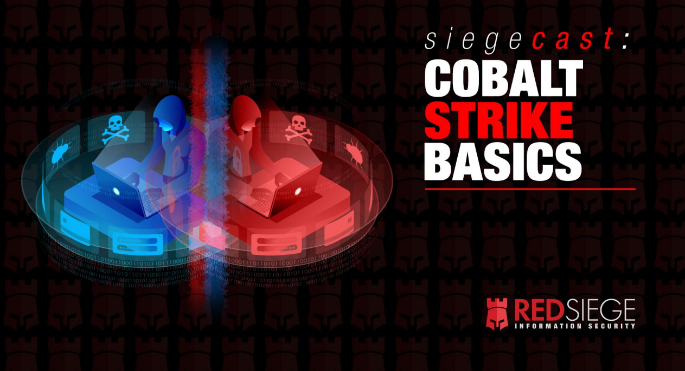

# 🫂 COBALT STRIKE BASIC

Marco de comando y control para pruebas de seguridad basadas en amenazas

Cobalt Strike es como Photoshop. Photoshop no crea arte para ti. Proporciona las herramientas a un profesional para crear obras maestras. Ambos son tan buenos como el operador.

Cobalt Strike es una herramienta de prueba de penetración (pentesting) y de operaciones de seguridad diseñada para ayudar a los profesionales de seguridad a simular y evaluar la seguridad de sistemas informáticos. Aquí tienes un resumen de algunas de sus características principales:

1. **Simulación de amenazas**: Cobalt Strike permite a los usuarios simular ataques cibernéticos de amenazas avanzadas, incluidos ataques de red, ataques de phishing, ataques de ransomware y más. Esto ayuda a las organizaciones a evaluar su postura de seguridad y a prepararse para posibles ataques reales.
2. **Funcionalidad de comando y control (C2)**: La herramienta facilita el establecimiento de un canal de comunicación seguro entre el atacante y los sistemas comprometidos. Esto permite al usuario controlar de forma remota los sistemas comprometidos y ejecutar comandos arbitrarios en ellos.
3. **Post-explotación avanzada**: Una vez que un sistema objetivo ha sido comprometido, Cobalt Strike proporciona una amplia gama de herramientas para realizar actividades de post-explotación, como enumeración de red, exfiltración de datos, escalada de privilegios, persistencia en sistemas comprometidos, y más.
4. **Funciones de ingeniería social**: La herramienta incluye características para facilitar la ingeniería social, como la creación de documentos maliciosos, campañas de phishing y otras tácticas para engañar a los usuarios y obtener acceso a sistemas.
5. **Módulos adicionales y personalización**: Cobalt Strike es altamente modular y permite a los usuarios agregar funcionalidades adicionales a través de módulos personalizados. También ofrece capacidades de scripting para la automatización de tareas y la personalización de ataques.

Es importante tener en cuenta que Cobalt Strike es una herramienta poderosa, pero su uso debe ser ético y legal.

<figure><figcaption></figcaption></figure>




