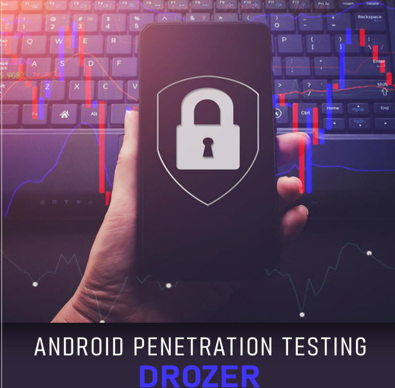

# 👽 DROZER - Android penetration

Drozer es un marco de pruebas de seguridad de aplicaciones de Android desarrollado por FSecureLABS que facilita que un evaluador cree casos de prueba y compruebe posibles vulnerabilidades en los componentes de una aplicación. Anteriormente se conocía como Mercury y también tiene menciones honoríficas en muchos de los principales libros de pruebas de seguridad de aplicaciones móviles. Es el estándar de facto para los marcos de prueba de seguridad de aplicaciones de Android.

Las características de Drozer son:

• Análisis estático de una aplicación.

• Ataque y creación de casos de prueba en la superficie de ataque de una aplicación.

• Ejecutar comandos de shell

• Elaboración de exploits para muchas vulnerabilidades conocidas.

• Realizar enumeraciones en varios paquetes.

Usaremos tres aplicaciones intencionalmente vulnerables para la demostración en este artículo: sieve (de MWR), diva (de Aseem Jakhar) y pivaa (de HTBridge).

<figure><figcaption></figcaption></figure>




