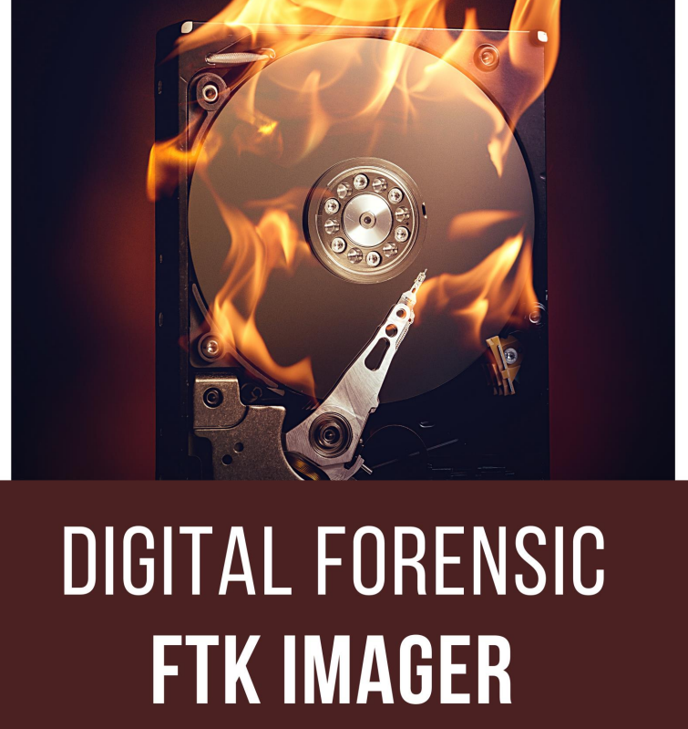

# 💿 FTK - Digital Forensic

FTK Imager es un software de código abierto de AccessData que se utiliza para crear copias precisas de la evidencia original sin realizar ningún cambio. La imagen de la evidencia original sigue siendo la misma y nos permite copiar datos a un ritmo mucho más rápido, que pronto podrá conservarse y analizarse más a fondo.&#x20;

El generador de imágenes FTK también le proporciona la función de verificación de integridad incorporada que genera un informe hash que ayuda a hacer coincidir el hash de la evidencia antes y después de crear la imagen de la evidencia original.

La adquisición de datos de un Disco Duro se conoce como imagen, quizás imagen forense cuando se realiza en una investigación. La creación de una imagen forense es uno de los pasos más cruciales de la investigación forense digital.

Sin embargo, este disco con imagen debe aplicarse al disco duro para funcionar. No se puede restaurar un disco duro colocando los archivos de imagen del disco en él, ya que es necesario abrirlo e instalarlo en el disco mediante un programa de imágenes.

Un solo disco duro puede almacenar muchas imágenes de disco. Las imágenes de disco también se pueden almacenar en unidades flash de mayor capacidad.

<figure><figcaption></figcaption></figure>




