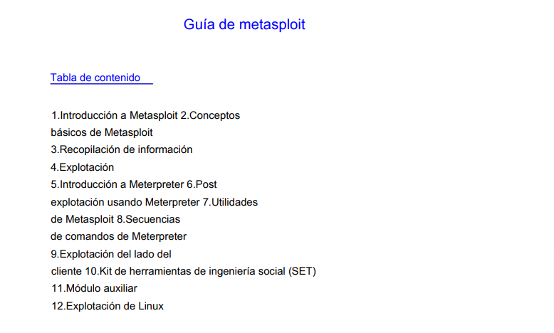
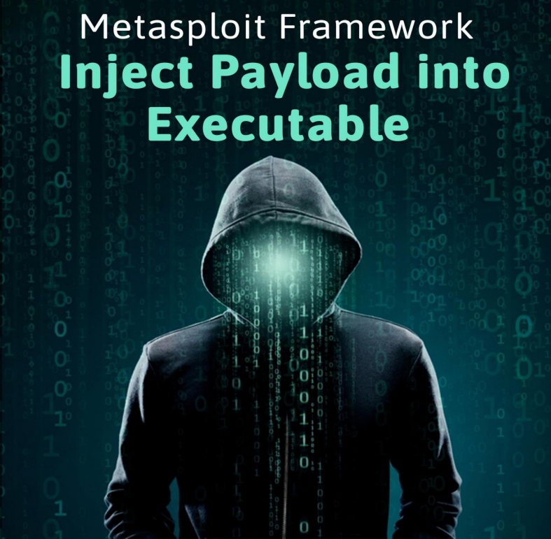
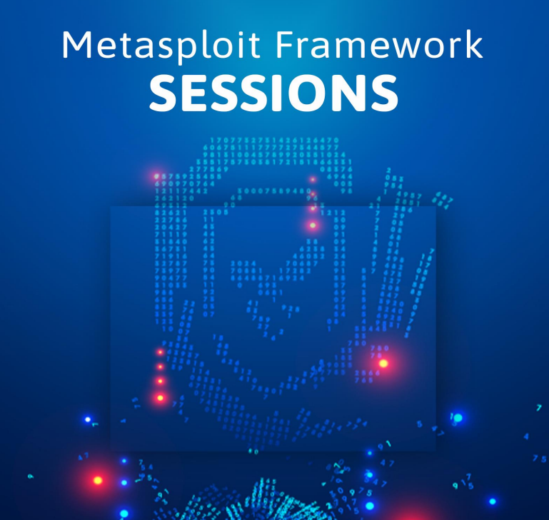

# 🎆 METASPLOIT

Metasploit es una plataforma de prueba de penetración utilizada por investigadores de seguridad y profesionales de ciberseguridad para probar la seguridad de sistemas informáticos. Se compone de una colección de herramientas, exploits y payloads que permiten encontrar vulnerabilidades en sistemas informáticos y aplicaciones.

Los alcances de Metasploit incluyen:

1. **Prueba de Penetración**: Permite a los expertos en seguridad simular ataques cibernéticos para identificar vulnerabilidades en sistemas informáticos, redes y aplicaciones.
2. **Desarrollo de Exploits**: Proporciona una plataforma para desarrollar y probar exploits, que son programas diseñados para aprovechar vulnerabilidades en el software.
3. **Automatización de Tareas**: Ofrece herramientas para automatizar tareas de prueba de seguridad, lo que facilita la identificación y explotación de vulnerabilidades.
4. **Educación en Seguridad**: Se utiliza ampliamente en entornos educativos y de capacitación para enseñar sobre seguridad informática y pruebas de penetración.

En resumen, Metasploit es una herramienta poderosa que se utiliza para evaluar la seguridad de sistemas informáticos mediante la identificación y explotación de vulnerabilidades, lo que ayuda a las organizaciones a fortalecer sus defensas contra ataques cibernéticos.

<figure><figcaption></figcaption></figure>





<figure><figcaption></figcaption></figure>





Metasploit for Pentester\_ Inject Payload into Executable

Introducción del módulo Peinjector

Este módulo inyectará una carga útil de Windows específica en un ejecutable de destino. Como sabemos, la víctima está utilizando putty.exe, que se encuentra en las descargas.

El siguiente paso es inyectarle la carga útil. Para ejecutar este módulo, necesitamos configurar el targetpe, que significa la ruta del archivo ejecutable de destino de la PC de la víctima, en el que se debe inyectar la carga útil.

Veremos mas en profundidad los pasos en el PDF:

<figure><figcaption></figcaption></figure>





Metasploit for Pentester\_ Sessions

El comando Sessions puede ejecutar un solo comando en múltiples sesiones y también actualizar un shell normal a meterpreter, entre otras cosas. Antes de comenzar con el comando de sesión, existen ciertos requisitos previos. Dado que los comandos de sesiones se utilizan para administrar múltiples sesiones dentro de Metasploit Framework, necesitaremos generar esas múltiples sesiones. Hemos comprometido algunas máquinas para generar las sesiones requeridas.

Una vez que haya obtenido la sesión de la máquina de la víctima, puede realizar muchas operaciones en el sistema de la víctima para recuperar información importante. Usando la opción de ayuda, podemos consultar la lista de opciones que podemos usar con el comando sesiones.

<figure><figcaption></figcaption></figure>




