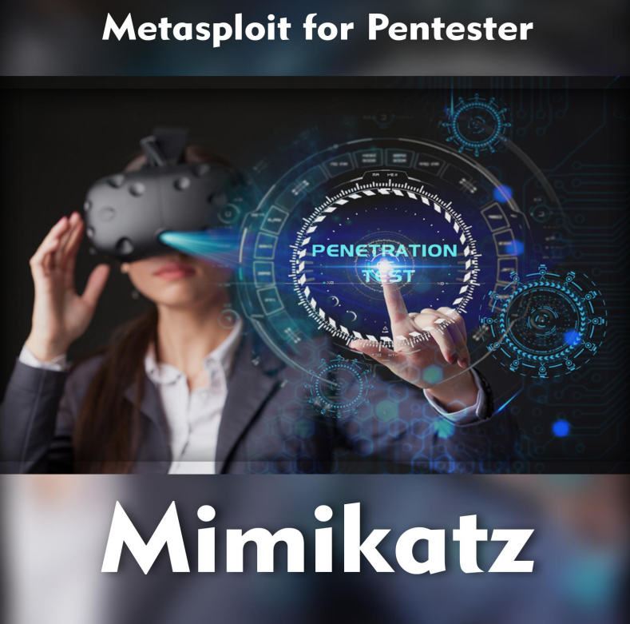

# 🤏 MIMIKATZ - obtencion de credenciales y posibles escaladas de privilegios para Windows

Para comenzar con la demostración, primero debemos comprometer una máquina con Windows que sea parte de una red gobernada por un controlador de dominio. La elección del compromiso es suya. Después del compromiso inicial a través de Metasploit, obtenemos un shell meterpreter. Hay un montón de comandos incorporados que se cargan dentro del shell de meterpreter. Si algunos comandos o un conjunto de comandos no están cargados, se pueden cargar en forma de módulo. Mimikatz también es un módulo que debe cargarse dentro del shell meterpreter. Después de cargar el módulo, puede presionar el comando de ayuda para ver una lista de diferentes opciones y ataques que se pueden realizar en la máquina de destino a través de este shell meterpreter.

"Mimikatz" es una herramienta de código abierto creada por Benjamin Delpy (también conocido como gentilkiwi) y utilizada en ciberseguridad. Su función principal es extraer contraseñas, hashes de contraseñas y otros datos de autenticación almacenados en sistemas Windows. Mimikatz es especialmente conocido por su capacidad para extraer contraseñas en texto plano y hashes de contraseñas almacenados en la memoria del sistema operativo, lo que puede ser útil para realizar pruebas de penetración, auditorías de seguridad y responder a incidentes de seguridad.

Algunas de las características y capacidades de Mimikatz incluyen:

1. **Extracción de Credenciales**: Mimikatz puede extraer credenciales almacenadas en la memoria del sistema, incluyendo contraseñas en texto plano, hashes de contraseñas NTLM, hashes de contraseñas Kerberos y tokens de autenticación.
2. **Pass-the-Hash (PtH)**: Permite realizar ataques de "pass-the-hash", que consisten en usar hashes de contraseñas robados en lugar de contraseñas reales para autenticarse en sistemas Windows y obtener acceso no autorizado.
3. **Golden Ticket**: Permite crear "Golden Tickets", que son tickets de autenticación de largo plazo válidos en sistemas Windows, lo que proporciona acceso persistente y no autorizado a recursos de la red.
4. **Silver Ticket**: Similar al Golden Ticket, permite crear "Silver Tickets", que son tickets de autenticación válidos para servicios específicos en sistemas Windows.
5. **DCSync**: Con la función DCSync, Mimikatz puede simular un controlador de dominio y solicitar copias de datos de autenticación de otros controladores de dominio, incluidos hashes de contraseñas de usuarios y otros datos confidenciales de Active Directory.

<figure><figcaption></figcaption></figure>




