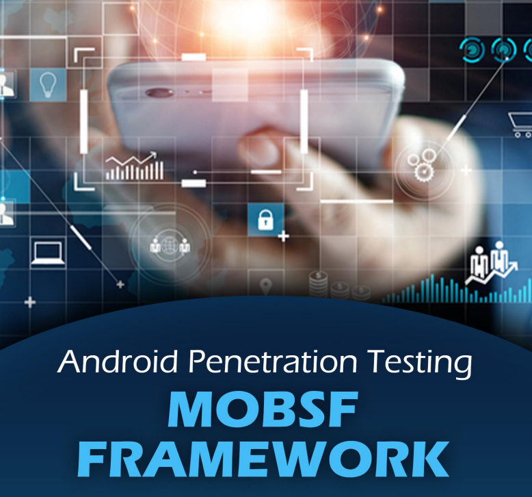

# 👽 MobSF Tool - para Android Pentest Automated Analysis

MobSF es una herramienta de código abierto desarrollada por Ajin Abraham que se utiliza para el análisis automatizado de un APK.

Esta es una colección de herramientas que se ejecutan en una interfaz, realizan sus propias tareas individuales (como Jadx, apktool, etc.) y muestran sus resultados en una interfaz común. Estos informes también se pueden descargar en formato PDF y también brindan análisis detallados con las capturas de pantalla necesarias. Puedes descargar MobSF aquí. En esta publicación, recorreremos la fase de instalación en el sistema operativo Ubuntu y lo guiaremos a través de varias opciones que esta herramienta tiene para ofrecer

<figure><figcaption></figcaption></figure>




