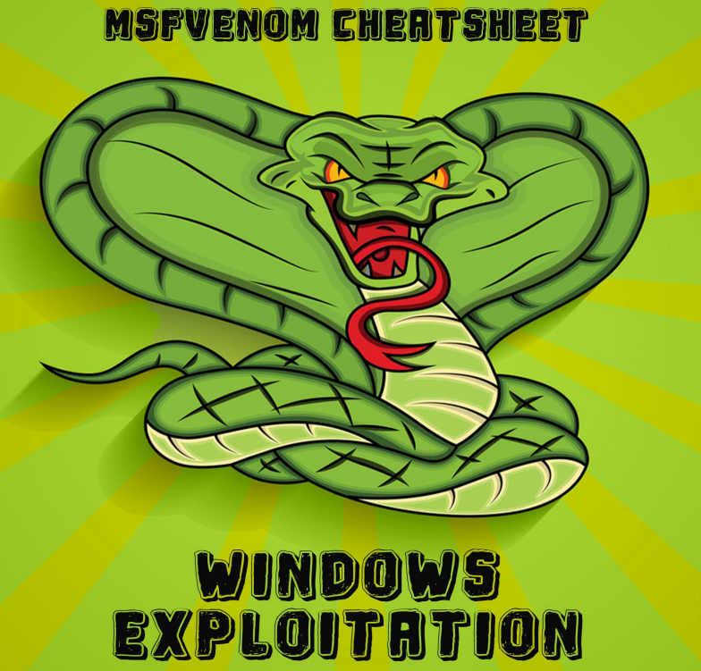

# 🐍 MSFVENOM - Generador de Payloads

msfvenom es una herramienta incluida en el marco de trabajo Metasploit que se utiliza para generar payloads (cargas útiles) maliciosas. Estas cargas útiles pueden ser utilizadas en una variedad de escenarios de pruebas de penetración, desde la explotación remota de vulnerabilidades hasta la creación de backdoors en sistemas comprometidos. msfvenom es extremadamente flexible y permite a los usuarios crear payloads personalizados para adaptarse a sus necesidades específicas.

Aquí hay algunas características clave de msfvenom:

1. **Generación de Payloads Multiplataforma**: msfvenom puede generar payloads para una amplia variedad de sistemas operativos y arquitecturas, incluidos Windows, Linux, macOS, Android y otros.
2. **Diversos Formatos de Salida**: Permite la generación de payloads en una variedad de formatos, como archivos ejecutables, scripts, códigos fuente, archivos DLL, y más, lo que brinda flexibilidad en la entrega y ejecución de las cargas útiles.
3. **Capacidad de Ofuscación**: msfvenom ofrece opciones para ofuscar payloads, lo que puede ayudar a evadir la detección por parte de software antivirus y otras soluciones de seguridad.
4. **Personalización Avanzada**: Los usuarios pueden personalizar diversos aspectos de los payloads generados, como el tipo de shellcode utilizado, las direcciones IP y puertos de conexión, las rutas de ejecución, y más, para adaptarse a sus necesidades específicas.
5. **Integración con Metasploit**: Como parte del marco de trabajo Metasploit, msfvenom se integra perfectamente con otras herramientas y módulos de Metasploit, lo que permite su uso en ataques coordinados y pruebas de penetración más avanzadas.

<figure><figcaption></figcaption></figure>




