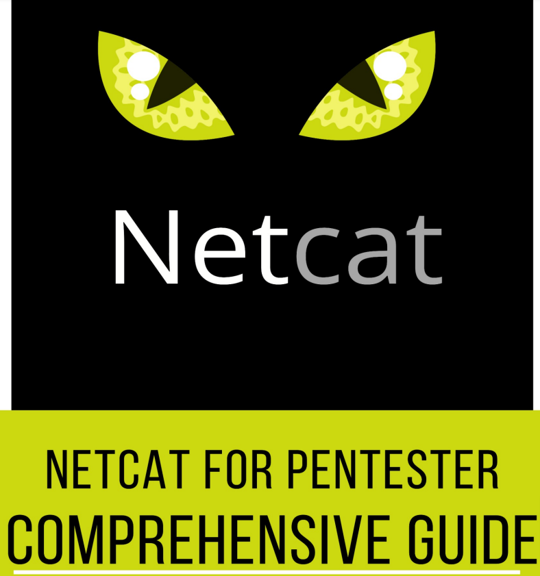

# 🐱 NETCAT - conexiones

"Ya sea escaneando puertos o obteniendo un shell inverso, todo es posible con Netcat". Hoy, en esta publicación, exploraremos una de las utilidades de red más utilizadas y aprenderemos cómo los otros marcos refuerzan "Netcat" para generar una sesión.

Netcat, técnicamente utilizado como "nc" , es una utilidad de red que utiliza conexiones TCP y UDP para leer y escribir en una red. Puede ser utilizado tanto por los atacantes como por los auditores de seguridad.

Contando en el escenario de ataque, esta herramienta multifuncional puede ser controlada por scripts, lo que la hace bastante confiable y, si analizamos la sección de seguridad, nos ayuda a depurar e investigar la red.

¿Por qué netcat es tan confiable que puede hacer de todo, ya sea escanear puertos, capturar pancartas, transferir un archivo o incluso generar una conexión inversa?

Veamos las principales funciones de netcat y desvelemos esta pregunta. (intermediación) servidor. Hasta ahora, es posible que conozcas todas las características que tiene Netcat, lo que lo hace único y simple.

1. Actúa como un cliente TCP/UDP/SCTP/SSL simple para interactuar con servidores web, servidores telnet, servidores de correo y otros servicios de red TCP/IP.
2. Redirige el tráfico TCP/UDP/SCTP a otros puertos o hosts actuando como SOCKS o HTTP. proxy de manera que los clientes especifiquen sus destinos.
3. Netcat puede incluso conectarse a destinos a través de una cadena de contactos anónimos o autenticados
4. Cifra la comunicación con SSL y la transporta a través de IPv4 o IPv6.
5. Actúa como intermediario de conexión, permitiendo que dos (o más) clientes se conecten a través de un tercero. (intermediación) servidor.

<figure><figcaption></figcaption></figure>




