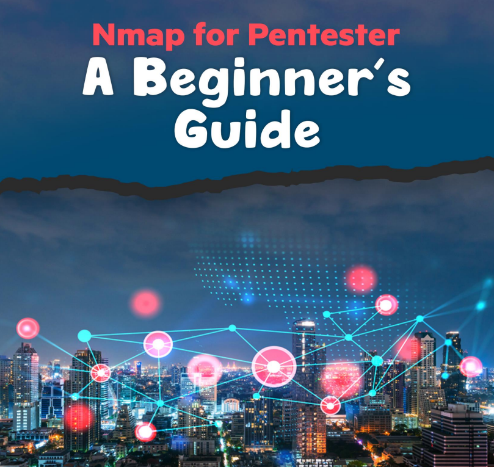
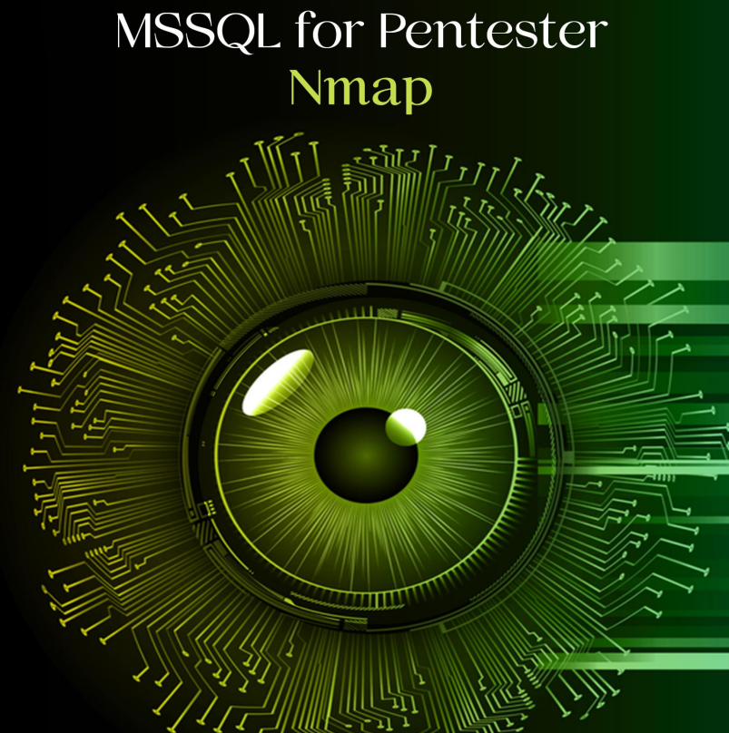

# 🌎 NMAP

Nmap se ha convertido en una de las herramientas más populares en el escaneo de redes, dejando atrás a otros escáneres. Muchas veces, los hosts de algunas organizaciones están protegidos mediante firewalls o sistemas de prevención de intrusiones que provocan fallos en el escaneo debido al conjunto actual de reglas que se utilizan para bloquear el tráfico de la red. En Nmap, un pentester puede utilizar fácilmente técnicas alternativas de descubrimiento de host para evitar que esto suceda. Consta de ciertas características que hacen que el tráfico de la red sea un poco menos sospechoso. Por lo tanto, veamos varias técnicas de Host Discovery

<figure><figcaption></figcaption></figure>





\---------------------------------------------------------------------------------------------------------------------

Nmap Scripting Engine (NSE) ha sido una de las características más eficientes de Nmap, permitiendo a los usuarios preparar y comparten sus scripts para automatizar las numerosas tareas que implica la creación de redes. Como sabemos sobre el Nmap velocidad y competencia, permite ejecutar estos scripts uno al lado del otro. Según las necesidades de los usuarios, pueden elija entre la variedad de scripts disponibles o cree sus propios scripts según los requisitos. Entonces, comencemos enumerando todos los scripts disponibles para descubrir la vulnerabilidad. Aquí vemos que un Una lista de scripts está disponible para detectar las vulnerabilidades. Uno por uno, ejecutaremos estos scripts y verificaremos si vulnerabilidades.

cd /usr/share/nmap/scripts/

ls -al _vulns_

<figure><figcaption></figcaption></figure>





\---------------------------------------------------------------------------------------------------------------------

Nmap ("Network Mapper") es una utilidad gratuita y de código abierto (con licencia) para el descubrimiento de redes y la auditoría de seguridad. Muchos administradores de sistemas y redes también lo encuentran útil para tareas como inventario de red, gestión de servicios cronogramas de actualización y monitoreo del tiempo de actividad del host o servicio. Nmap utiliza paquetes IP sin procesar de formas novedosas para determinar qué hosts están disponibles en la red, qué servicios (nombre y versión de la aplicación) ofrecen esos hosts, qué sistemas operativos (y versiones de SO) están ejecutando, qué tipo de filtros de paquetes/firewalls están en uso, y docenas de otras características. Fue diseñado para escanear rápidamente redes grandes, pero funciona bien contra una sola Hospedadores. Nmap se ejecuta en todos los principales sistemas operativos informáticos y hay paquetes binarios oficiales disponibles para Linux, Windows y MacOS X

<figure><figcaption></figcaption></figure>





***

\---------------------------------------------------------------------------------------------------------------------

Hola a todos. Hoy veremos cómo capturar paquetes de red usando nmap. Y usaremos Wireshark para comparar sus resultados con nmap. En este artículo, nos centramos principalmente en qué tipos de tráfico de red captura nmap mientras utilizamos varios escaneos de ping de nmap.

Se realiza un escaneo de ping en Nmap para verificar si el host de destino está vivo o no. Como sabemos, ping envía de forma predeterminada la solicitud de eco ICMP y obtiene una respuesta de eco ICMP si el sistema está activo. El escaneo de ping envía de forma predeterminada un paquete ARP y obtiene una respuesta para verificar si el host está activo.

<figure><figcaption></figcaption></figure>





\---------------------------------------------------------------------------------------------------------------------

Requisito Atacante: Kali Linux (NMAP) Objetivo: Windows 10 (MS SQL Server) Nmap es una colección de scripts NSE basados en Lua que realizan autenticación y no autenticación. pruebas de penetración en el puerto MS-SQL 1433. El script NSE para MS-SQL se puede identificar utilizando el instrucciones a continuación.

<figure><figcaption></figcaption></figure>




