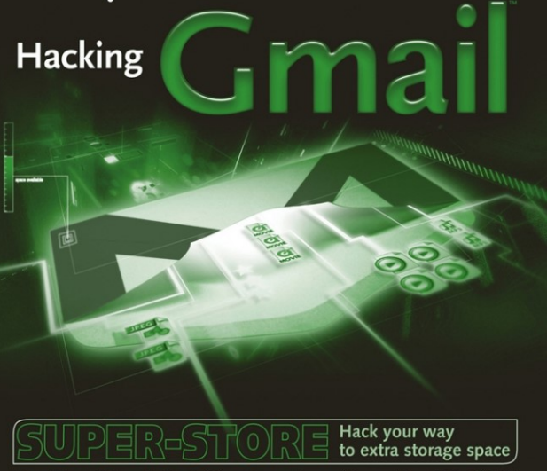

# GMAIL HACKING

Hackear Gmail. Es un pasatiempo varonil y este libro le dirá cómo hacerlo. ¿Lo siento? Qué ¿Gmail, preguntas? Bueno, déjame decirte. .&#x20;

Por supuesto, todo ese poder simplemente merece ser abusado. El poder corrompe, como dicen, y los hackers no son más que un grupo corrupto: casi tan pronto como Gmail fue lanzado, los piratas informáticos buscaban formas de utilizar esas capacidades para otros fines. Investigaron la interfaz increíblemente rica y vieron cuánto del procesamiento se realiza en la propia máquina del usuario; se adentraron en la comunicación entre el navegador y el servidor; y desarrollaron una serie de interfaces para lenguajes de scripting para permitirle controlar Gmail desde sus propios programas.

<figure><figcaption></figcaption></figure>


