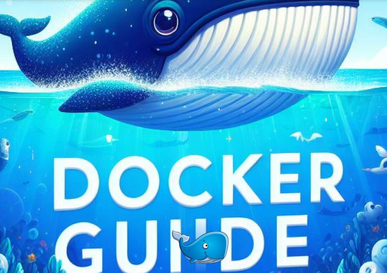

# 🐳 DOCKER

Si eres un novato explorando el mundo de Docker o un profesional experimentado que busca una referencia rápida, estás en el lugar correcto lugar. Esta guía completa está diseñada para abordar tanto principiantes como usuarios experimentados, ofreciendo una completa exploración de comandos y conceptos esenciales de Docker. Explore la creación y administración de imágenes de Docker. comprender la gestión de contenedores y dominar Sintaxis de Dockerfile, sumérjase en las complejidades de Docker Compose, y conozca las funciones más recientes, como Docker Compose Watch con explicaciones claras, orientación paso a paso y ejemplos prácticos ilustrativos. Con todos los comandos y conceptos necesarios, esta guía le ayudará a empezar a utilizar Docker muy rápidamente. Adelante ¡Y léelo!

<figure><figcaption></figcaption></figure>


