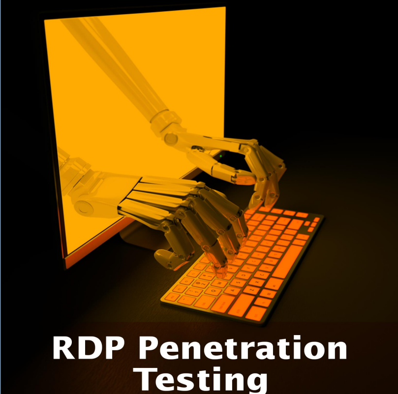

# 🖥️ RDP PENETRATION TESTING

Según Wikipedia, el Protocolo de Escritorio Remoto (RDP), también conocido como "Cliente de Servicios de Terminal", es un Protocolo propietario desarrollado por Microsoft que permite a un usuario conectarse a otra computadora a través de una red. conexión mediante una interfaz gráfica. Los servidores RDP están integrados en los sistemas operativos Windows; por defecto, el El servidor escucha en el puerto TCP 3389. En un entorno de red, es una buena práctica desactivar los servicios que no se están utilizando, ya que pueden ser los causa potencial de un compromiso. El Servicio de Escritorio remoto no es una excepción a esto. Si el servicio está deshabilitado en el sistema, se puede habilitar siguiendo los siguientes pasos. Dentro del panel de control del sistema, existe un sistema y sección de seguridad. Dentro de esta sección, hay una sección de sistema. Después de atravesar esta sección, en el menú del lado izquierdo, existe una opción de Configuración remota, como se muestra en la imagen a continuación. También se puede comprobar que El sistema en el que estamos trabajando es Windows 10 Enterprise Edition.

<figure><figcaption></figcaption></figure>




