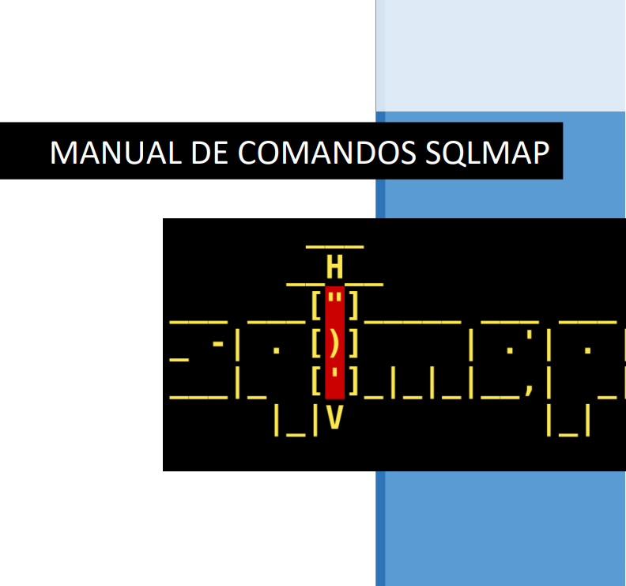

# 💉 SQLMAP

SQLMap es una herramienta de prueba de penetración de código abierto que automatiza el proceso de detección y explotación de vulnerabilidades de inyección SQL en aplicaciones web y bases de datos. Es una herramienta muy popular y potente utilizada por profesionales de la seguridad informática y los investigadores de penetración para identificar y explotar vulnerabilidades de inyección SQL en aplicaciones web.

Aquí hay algunas características clave de SQLMap:

1. **Detección Automática de Vulnerabilidades**: SQLMap puede detectar automáticamente vulnerabilidades de inyección SQL en aplicaciones web al analizar las solicitudes HTTP y las respuestas del servidor.
2. **Soporte para Múltiples Sistemas de Gestión de Bases de Datos (DBMS)**: Es compatible con una amplia gama de sistemas de gestión de bases de datos, incluidos MySQL, PostgreSQL, Microsoft SQL Server, Oracle, SQLite, y otros.
3. **Explotación de Vulnerabilidades**: Una vez que se detecta una vulnerabilidad de inyección SQL, SQLMap puede explotarla automáticamente para obtener información confidencial de la base de datos, como nombres de tablas, columnas, datos de usuarios y contraseñas, y más.
4. **Enumeración de la Base de Datos**: SQLMap proporciona funciones para enumerar la estructura de la base de datos y extraer datos de la base de datos, lo que ayuda a los investigadores de penetración a recopilar información valiosa sobre el objetivo.
5. **Soporte para Ataques Avanzados**: SQLMap ofrece una amplia gama de opciones y parámetros para personalizar y optimizar los ataques, incluidos ataques de fuerza bruta, inyección de código SQL personalizado, técnicas de encadenamiento de ataques y más.

<figure><figcaption></figcaption></figure>


