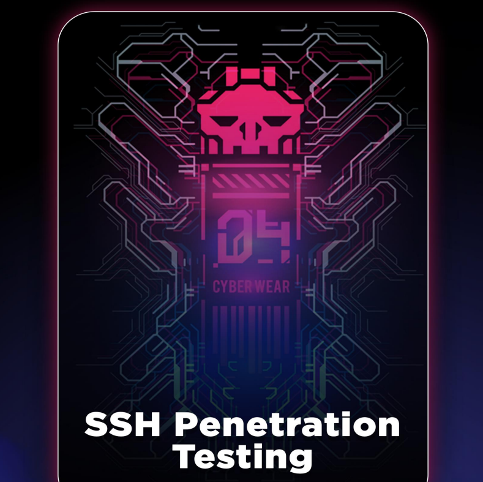

# 🔐 SSH - Secure Shell

El protocolo SSH, también conocido como Secure Shell, es una técnica para iniciar sesión remotamente de forma segura y confiable desde una computadora a otra. Ofrece varias opciones para una autenticación sólida, ya que protege la seguridad e integridad de las conexiones y las comunicaciones con un cifrado sólido. Es una alternativa segura a los protocolos de inicio de sesión no protegidos (como telnet, rlogin) y a los métodos de transferencia de archivos inseguros (como FTP).

<figure><figcaption></figcaption></figure>





***

Básicamente, la tunelización es un proceso que permite compartir datos o comunicarse entre dos redes diferentes de forma privada. La tunelización normalmente se realiza encapsulando los datos de la red privada y la información del protocolo dentro de las unidades de transmisión de la red pública de modo que la información del protocolo de la red privada sea visible para la red pública como datos.

Túnel SSH: el túnel es el concepto de encapsular el protocolo de red en otro protocolo. Aquí lo ponemos en SSH, por lo que todas las comunicaciones de la red están cifradas. Debido a que la creación de túneles implica reempaquetar los datos de tráfico en una forma diferente, tal vez con cifrado como estándar, un tercer uso es ocultar la naturaleza del tráfico que circula a través de los túneles.

Tipos de túneles SSH:

1. Túnel SSH dinamico
2. . Túnel SSH local
3. Túnel SSH remoto

<figure><figcaption></figcaption></figure>




