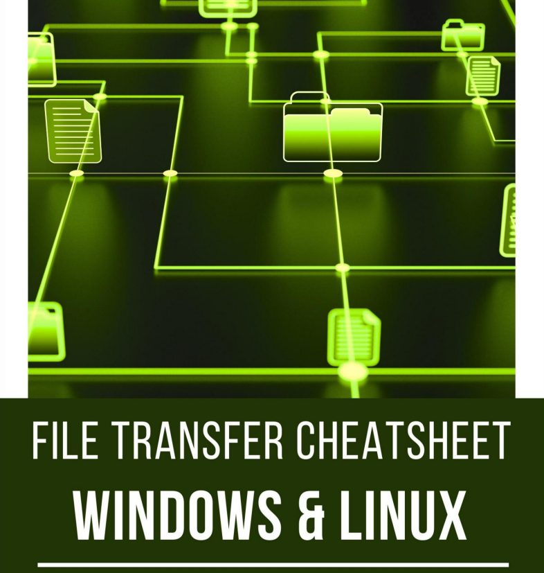

# 📤 TRANSFERIR ARCHIVOS EN WINDOWS O LINUX

Mientras realiza las pruebas de penetración, llega a una etapa en la que ya ha comprometido el sistema de la víctima y está buscando los protocolos correctos que puede usar después de la explotación para transferir archivos desde la máquina del atacante a la máquina de la víctima. La transferencia de archivos se considera uno de los pasos más importantes involucrados en la posexplotación. Entonces, hoy en este artículo vamos a resaltar las diversas técnicas que puede utilizar el pentester para transferir archivos a la máquina víctima (máquina Windows y Linux).&#x20;

Esta hoja de referencia sobre transferencia de archivos se centra ampliamente en la realización de pruebas de penetración y equipos rojos y también entre otras mientras se resuelven los CTF en el campo de la seguridad. Entonces, veamos los requisitos para transferir el archivo en Victim Machine.

<figure><figcaption></figcaption></figure>




