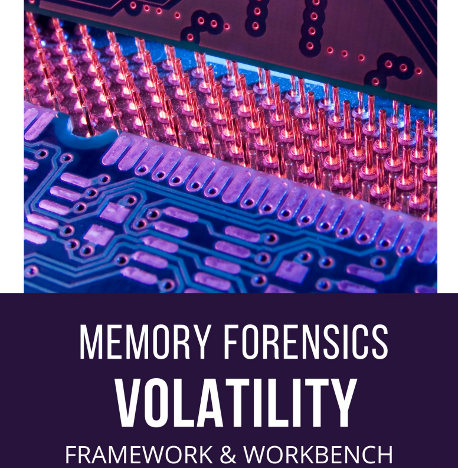

# 📝 VOLATILITY - Memory Forensic

Los ciberdelincuentes y los atacantes se han vuelto tan creativos en su tipo de delito que han comenzado a encontrar métodos para ocultar datos en la memoria volátil de los sistemas. Hoy, en este artículo, comprenderemos mejor la adquisición de memoria viva y su análisis forense. La adquisición de Live Memory es un método que se utiliza para recopilar datos cuando el sistema se encuentra en estado activo en la escena del crimen

La memoria forense es una división de la ciencia forense digital que generalmente enfatiza la extracción de artefactos de la memoria volátil de un sistema que fue comprometido. Este dominio se está extendiendo rápidamente en las investigaciones de delitos cibernéticos. La razón principal de esto es que ciertos artefactos se extraen únicamente de la memoria del sistema y no se pueden encontrar en ningún otro lugar.

Analizar la memoria después de capturar la memoria RAM es sumamente importante cuando se trata de recopilar información sobre los puertos que estaban en uso, la cantidad de procesos en ejecución y la ruta de ciertos ejecutables en el sistema mientras se realiza la investigación. Volatility Framework es una de esas herramientas de análisis de memoria que funciona en la línea de comandos en sistemas Windows y Linux .

Volatility Workbench es una versión GUI de una de las mismas herramientas Volatility para analizar los artefactos de un volcado de memoria. Está disponible de forma gratuita, de código abierto y se ejecuta en el sistema operativo Windows.

<figure><figcaption></figcaption></figure>




