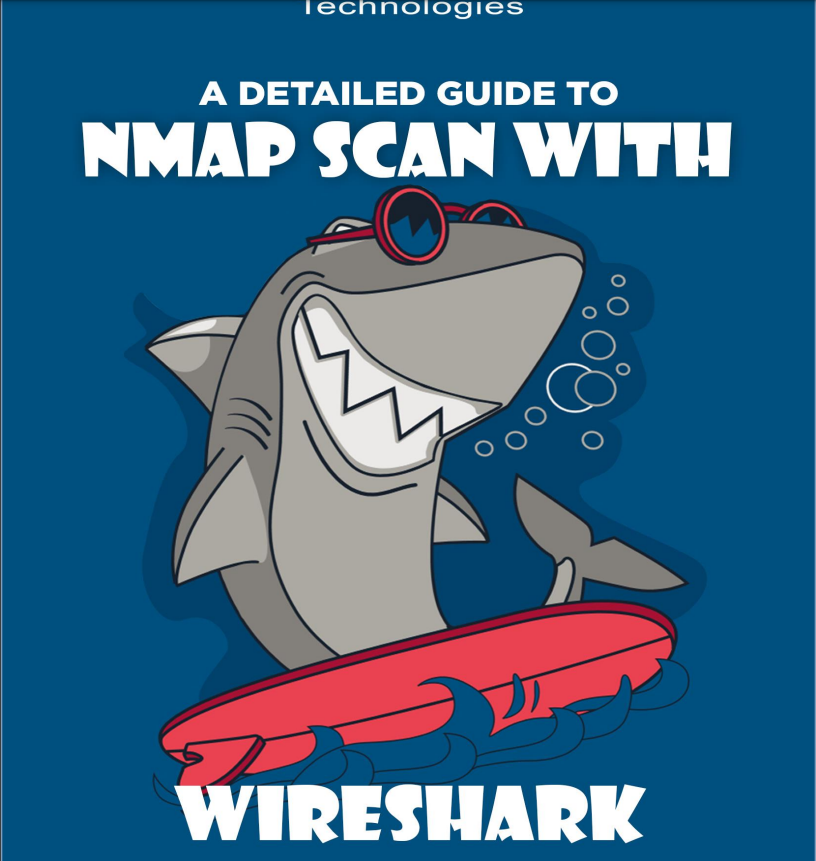

# 🦈 WIRESHARK

Mucha gente se pregunta si Wireshark puede capturar contraseñas. ¡La respuesta es sin duda sí! Wireshark puede capturar no sólo contraseñas, sino también cualquier tipo de datos que pasen por una red: nombres de usuario, direcciones de correo electrónico, información personal, imágenes, vídeos o cualquier otra cosa.

Wireshark puede detectar las contraseñas que pasan siempre que podamos capturar el tráfico de la red. Pero la pregunta es ¿qué tipo de contraseñas son? O, más precisamente, ¿qué contraseñas de protocolos de red podemos obtener? Ése es el tema de este informe.

En la primera sección de este informe, profundizaremos en la "crítica forense de paquetes de red", explorando aspectos vitales como la transferencia de datos entre nodos, el "modelo OSI de 7 capas" y cómo Wireshark almacena información entre capas al capturar el tráfico de la red.

Pasando a la segunda parte, examinaremos cómo Wireshark puede capturar contraseñas, como resultado de ciertos protocolos de red no cifrados conocidos como protocolos de texto claro. Estos protocolos exponen todos los datos, incluidas las contraseñas, haciéndolos visibles para cualquier persona con la capacidad de interceptar la comunicación, como un intermediario.

<figure><figcaption></figcaption></figure>





***

En esta publicación, aprenderá cómo capturar paquetes de red usando Wireshark cuando un atacante está escaneando un objetivo usando el método de escaneo de puertos NMAP. Aquí notará cómo Wireshark capturó diferentes paquetes de tráfico de red para puertos abiertos y cerrados.

<figure><figcaption></figcaption></figure>





***

Hoy analizamos cómo leer bytes hexadecimales de un paquete IP que ayuda al administrador de red a identificar varios tipos de escaneo NMAP. Pero antes de seguir adelante, lea nuestros artículos anteriores, "Análisis forense de paquetes de red" y "Escaneo NMAP con Wireshark".

<figure><figcaption></figcaption></figure>




