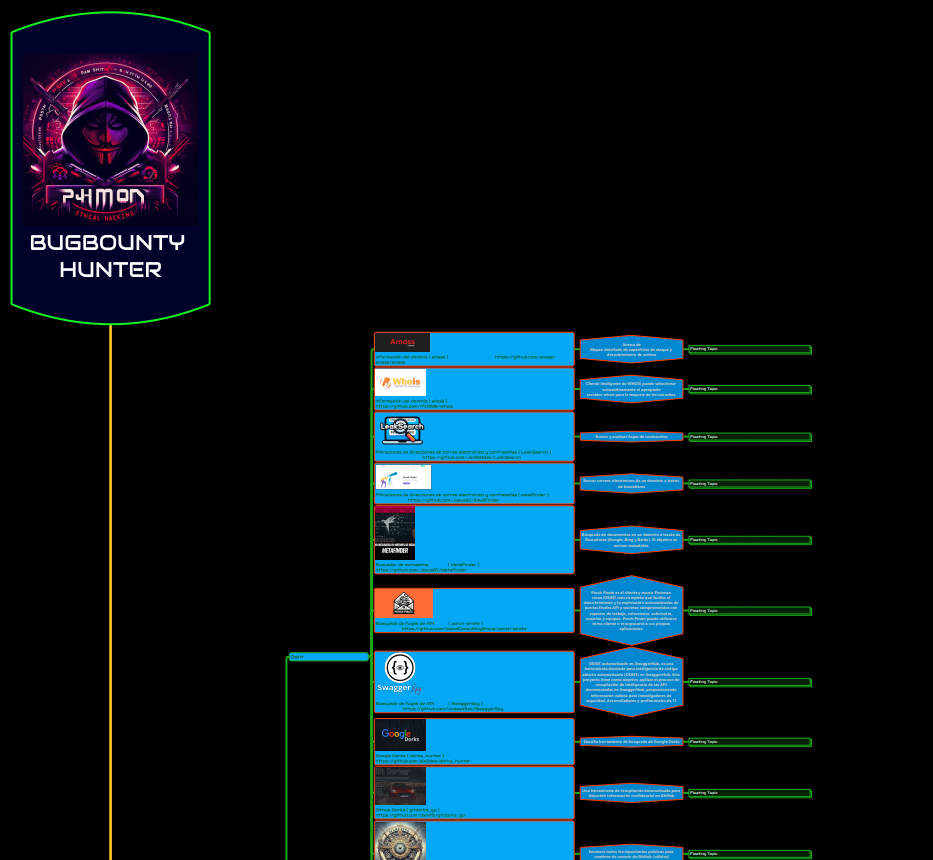

# 🐞 MAPA MENTAL PARA AUDITORIA EN BUGBOUNTY HUNTING

**Mapa Mental para Auditoría en Bug Bounty Hunting**

**Descripción:** Este mapa mental detallado ofrece una guía paso a paso para identificar más de 250 vulnerabilidades utilizando la plataforma de PortSwigger. Está diseñado para cazadores de bug bounty, proporcionando enlaces directos a laboratorios específicos, herramientas útiles y un diagrama para recopilar y organizar información adicional durante el proceso de auditoría.

**Estructura:** El mapa mental se organiza en varias secciones, cada una dirigida a una vulnerabilidad específica. Por ejemplo, se incluyen secciones para la divulgación de información en mensajes de error, en la página de depuración y a través de archivos de respaldo.

**Funcionalidades Destacadas:**

1. **Acceso a Laboratorios:** Se proporcionan instrucciones claras sobre cómo acceder a cada laboratorio relevante dentro de la plataforma de PortSwigger para practicar la detección de vulnerabilidades en un entorno controlado.
2. **Soluciones Paso a Paso:** Para cada escenario de vulnerabilidad, se ofrecen soluciones detalladas paso a paso, utilizando herramientas como Burp Suite para identificar y explotar las vulnerabilidades.
3. **Enlaces Relevantes:** Se incluyen enlaces directos a recursos útiles, como herramientas de auditoría, que pueden ayudar en la detección y explotación de vulnerabilidades.
4. **Diagrama de Recopilación de Información:** Se proporciona un diagrama que permite a los usuarios recopilar y organizar información adicional encontrada durante la auditoría, facilitando un enfoque sistemático y organizado.

**Beneficios para el Público Interesado:**

1. **Aprendizaje Estructurado:** Para los aspirantes a cazadores de bug bounty, este mapa mental ofrece una forma estructurada de aprender y practicar la identificación de vulnerabilidades en aplicaciones web.
2. **Herramienta Práctica:** Los profesionales de la ciberseguridad pueden utilizar este recurso como una guía práctica durante sus auditorías, asegurando que no se pasen por alto posibles puntos débiles en las aplicaciones.
3. **Personalizable y Escalable:** La naturaleza modular del mapa mental permite a los usuarios agregar sus propias técnicas y metodologías a medida que avanzan en su experiencia en la detección de vulnerabilidades.

**Dónde Encontrarlo:** Este mapa mental estará disponible en el GitBook y GitHub del creador, así como en su portafolio personal, asegurando que esté ampliamente accesible para la comunidad interesada en la ciberseguridad y la caza de recompensas por errores.

a

<figure><figcaption></figcaption></figure>




